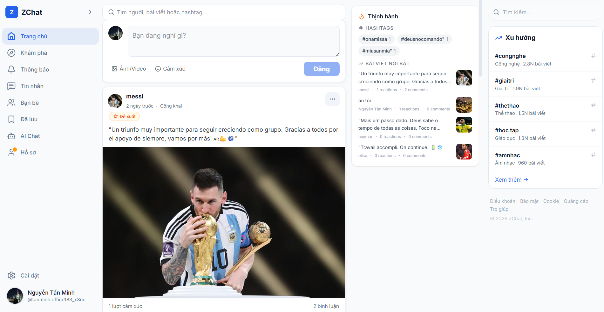

<div align="center">
  <h1>⚡ ZConnect</h1>
  <p><strong>Mạng xã hội thế hệ mới — Real-time, AI-powered, Full-stack</strong></p>

  <p>
    <a href="https://zconnect-me.pages.dev/" target="_blank">
      
    </a>
    <a href="https://github.com/minhnt2510/zconnect/actions/workflows/deploy.yml">
      
    </a>
    
  </p>

  <p>
    <strong><a href="https://zconnect-me.pages.dev/">🚀 Live Demo</a></strong>
    ·
    <strong><a href="#-tính-năng-chính">Tính năng</a></strong>
    ·
    <strong><a href="#-cài-đặt--chạy">Cài đặt</a></strong>
    ·
    <strong><a href="#-công-nghệ">Công nghệ</a></strong>
  </p>
</div>

---

## 📖 Giới thiệu

**ZConnect** là nền tảng mạng xã hội full-stack được phát triển trong khuôn khổ môn học **Công nghệ mới**. Dự án tích hợp nhắn tin real-time, bảng tin tương tác, gọi thoại/video, và trợ lý AI thông minh — tất cả trong một hệ thống đồng bộ, hiện đại.

| | |
|---|---|
| **Frontend** | React 19 + TypeScript + Tailwind CSS 4 |
| **Backend** | NestJS + TypeORM + MySQL/MariaDB |
| **Real-time** | Socket.IO |
| **AI** | Google Gemini (LangChain) |
| **Deploy** | CI/CD tự động qua Render |

## 🚀 Demo

Trải nghiệm trực tiếp tại: [**https://zconnect-me.pages.dev/**](https://zconnect-me.pages.dev/)

---

## ✨ Tính năng chính

### 💬 Nhắn tin & Gọi
| Tính năng | Mô tả |
|-----------|-------|
| **Chat real-time** | Nhắn tin 1-1 và nhóm qua Socket.IO |
| **Gọi thoại/video** | WebRTC peer-to-peer, hỗ trợ group call |
| **Chia sẻ media** | Ảnh, video, file, sticker |
| **Phản ứng tin nhắn** | Reactions, reply, ghim tin nhắn |

### 📰 Bảng tin & Xã hội
| Tính năng | Mô tả |
|-----------|-------|
| **Bảng tin động** | Bài viết, like, bình luận, chia sẻ |
| **Kết bạn** | Gửi/chấp nhận lời mời, gợi ý bạn bè |
| **Khám phá** | Xu hướng, hashtag, nội dung nổi bật |
| **Media gallery** | Ảnh, video từ bài viết |

### 🤖 AI Thông minh
| Tính năng | Mô tả |
|-----------|-------|
| **Chat AI** | Trò chuyện với Google Gemini |
| **Phân tích cảm xúc** | Nhận diện tâm trạng bài viết |
| **Gợi ý trả lời** | Đề xuất phản hồi thông minh |
| **Tóm tắt hội thoại** | Rút gọn nội dung chat |

### 🛡️ Quản trị & Kiểm duyệt
| Tính năng | Mô tả |
|-----------|-------|
| **Admin dashboard** | Thống kê, quản lý người dùng |
| **Moderation** | Duyệt báo cáo, xử lý vi phạm |
| **Audit logs** | Lịch sử hoạt động hệ thống |

---

## 🛠️ Công nghệ

### Frontend
```
React 19 + TypeScript + Vite
Tailwind CSS 4 + shadcn/ui
Zustand · React Router v7
Socket.IO Client · Framer Motion
Recharts · React Hook Form + Zod
```

### Backend
```
NestJS + TypeORM
MySQL / MariaDB
Passport.js (JWT, OAuth)
Socket.IO · LangChain
Google Generative AI
AWS S3 · Nodemailer
Swagger (API docs)
```

---

## 📁 Cấu trúc dự án

```
/
├── soccial-media-backend/          # Backend NestJS
│   ├── src/
│   │   ├── modules/
│   │   │   ├── auth/               # Xác thực (JWT, OAuth, OTP)
│   │   │   ├── user/               # Người dùng
│   │   │   ├── post/               # Bài viết
│   │   │   ├── comment/            # Bình luận
│   │   │   ├── conversation/       # Hội thoại
│   │   │   ├── message/            # Tin nhắn real-time
│   │   │   ├── friendship/         # Kết bạn
│   │   │   ├── notification/       # Thông báo
│   │   │   ├── discovery/          # Khám phá / gợi ý
│   │   │   ├── ai/                 # AI chat, phân tích
│   │   │   ├── call/               # Gọi thoại/video
│   │   │   ├── report/             # Báo cáo vi phạm
│   │   │   └── system-setting/     # Cài đặt hệ thống
│   │   ├── common/                 # Shared (guards, decorators, socket)
│   │   └── main.ts
│   └── database/                   # SQL scripts
│
├── soccial-media-web/              # Frontend React
│   └── src/
│       ├── pages/
│       │   ├── (app)/
│       │   │   ├── feed/           # Bảng tin
│       │   │   ├── messages/       # Tin nhắn
│       │   │   ├── friends/        # Bạn bè
│       │   │   ├── explore/        # Khám phá
│       │   │   ├── notifications/  # Thông báo
│       │   │   ├── profile/        # Hồ sơ
│       │   │   ├── ai-chat/        # AI chat
│       │   │   ├── call/           # Gọi thoại/video
│       │   │   ├── admin/          # Quản trị
│       │   │   └── settings/       # Cài đặt
│       │   └── auth/               # Đăng nhập, OTP
│       ├── components/             # UI components
│       ├── contexts/               # Zustand stores
│       ├── hooks/                  # Custom hooks
│       ├── routes/                 # Route config
│       ├── services/               # API services
│       └── types/                  # TypeScript types
│
├── .github/workflows/deploy.yml    # CI/CD pipeline
└── README.md
```

---

## ⚙️ Cài đặt & Chạy

### Yêu cầu
- **Node.js** >= 18
- **MySQL** / **MariaDB**
- **npm**

### Backend

```bash
cd soccial-media-backend
cp .env.example .env    # Cấu hình database, JWT secret,...
npm install
npm run start:dev       # http://localhost:3000
# API docs: http://localhost:3000/api
```

### Frontend

```bash
cd soccial-media-web
npm install
npm run dev             # http://localhost:8088
```

---

## 🔐 Biến môi trường

### Backend

| Biến | Mô tả |
|------|-------|
| `DB_HOST` | Database host |
| `DB_PORT` | Database port |
| `DB_USERNAME` | Database user |
| `DB_PASSWORD` | Database password |
| `DB_DATABASE` | Database name |
| `JWT_SECRET` | JWT signing key |
| `JWT_EXPIRES_IN` | JWT expiration |
| `OTP_SECRET` | OTP secret |
| `GOOGLE_CLIENT_ID` | Google OAuth client ID |
| `GITHUB_CLIENT_ID` | GitHub OAuth client ID |
| `GEMINI_API_KEY` | Google Gemini API key |
| `AWS_ACCESS_KEY_ID` | AWS S3 access key |
| `AWS_SECRET_ACCESS_KEY` | AWS S3 secret key |
| `AWS_REGION` | AWS region |
| `AWS_S3_BUCKET` | S3 bucket name |
| `MAIL_HOST` | SMTP host |
| `MAIL_USER` | SMTP user |
| `MAIL_PASS` | SMTP password |

### Frontend

| Biến | Mô tả |
|------|-------|
| `VITE_API_BASE_URL` | Backend API URL |
| `VITE_SOCKET_URL` | WebSocket URL |
| `VITE_GOOGLE_CLIENT_ID` | Google OAuth client ID |

---

## 🤝 Đóng góp

Dự án được phát triển bởi nhóm **Công nghệ mới**.

- **GitHub Team**: [new-technology-team](https://github.com/new-technology-team)
- **GitHub Fork**: [minhnt2510/zconnect](https://github.com/minhnt2510/zconnect)

---

<div align="center">
  <p>
    <strong>ZConnect</strong> — Mạng xã hội thế hệ mới<br>
    <sub>Built with ❤️ for the New Technology course</sub>
  </p>
  <p>
    <a href="https://zconnect-me.pages.dev/">🚀 Live Demo</a>
  </p>
</div>
